  

  
  
  

I build AI systems that must **reason over evidence, survive real constraints, and explain what they did**. I currently work with **FundU** on agentic AI for investor data rooms and evidence-grounded document analysis while completing an Engineering Degree in ICT, Artificial Intelligence & Data at **SUP'COM, University of Carthage**.

My work sits between applied research and product engineering: agent security, evaluation, multimodal and retrieval systems, efficient deep learning, and the infrastructure needed to test them honestly.

> **Open to a PFE / end-of-studies internship from February 2027** in AI engineering or applied ML research. Ready to relocate across Europe.

## Featured work

<table>
  <tr>
    <td width="50%" valign="top">
      <h3><a href="https://github.com/OussemaHarrabi/IndabaX26">AegisGraph</a></h3>
      
<strong>Pre-action security gateway for AI agents.</strong> A provenance-aware policy engine that evaluates inert actions and returns allow, block, escalate, or rewrite decisions, backed by a reproducible Qwen3-8B evaluation and an investigation dashboard.

      
<code>Python</code> <code>FastAPI</code> <code>Pydantic</code> <code>Agent Security</code> <code>Evaluation</code>

      
Measured on one seeded public suite: 0/22 reached attacks succeeded with v5; 9.284 ms p95 policy latency. See the repository for scope and limitations.

    </td>
    <td width="50%" valign="top">
      <h3><a href="https://github.com/OussemaHarrabi/ClaimGuard">ClaimGuard</a></h3>
      
<strong>Evidence-first healthcare claim pre-validation.</strong> A team-built platform that normalizes synthetic claim packages, executes versioned deterministic checks, links findings to source evidence, and preserves human review through a tamper-evident audit trail.

      
<code>Next.js</code> <code>FastAPI</code> <code>PostgreSQL</code> <code>Docker</code> <code>FHIR</code>

    </td>
  </tr>
  <tr>
    <td width="50%" valign="top">
      <h3><a href="https://github.com/OussemaHarrabi/SpectraQuant">SpectraQuant</a> research in progress</h3>
      
<strong>Budget-aware low-rank and low-bit transformer research.</strong> Investigating whether output-aware sensitivity can allocate ranks and bit widths that improve the quality–memory frontier over uniform compression at equal budget.

      
<code>PyTorch</code> <code>Quantization</code> <code>Low-rank Methods</code> <code>Hydra</code> <code>Cloud GPU</code>

    </td>
    <td width="50%" valign="top">
      <h3><a href="https://github.com/OussemaHarrabi/BMO">BMO</a></h3>
      
<strong>Local multimodal memory assistant.</strong> Captures and interprets screen activity, connects semantic memories, and retrieves prior context through a privacy-focused local pipeline.

      
<code>Vision AI</code> <code>RAG</code> <code>Qdrant</code> <code>Neo4j</code> <code>Next.js</code>

    </td>
  </tr>
</table>

  
  
  

## What I care about

| Direction | Questions I am working on |
| --- | --- |
| **Reliable agent systems** | How can provenance, bounded contracts, policy enforcement, and evaluation make tool-using agents safer and more inspectable? |
| **Efficient deep learning** | How should rank, precision, memory, and quality be allocated under a real compute budget? |
| **Evidence-grounded AI** | How can retrieval and structured reasoning keep decisions connected to the documents, policies, and observations that support them? |
| **Research that ships** | Can an experiment remain reproducible while becoming a tested API, usable interface, observable service, and clear technical report? |

## Engineering toolkit

  

  
  
  
  
  

## Activity

  <picture>
    <source media="(prefers-color-scheme: dark)" srcset="https://github-readme-stats.vercel.app/api?username=OussemaHarrabi&show_icons=true&hide_border=true&bg_color=00000000&title_color=7DD3FC&text_color=CBD5E1&icon_color=2DD4BF&rank_icon=github" />
    <source media="(prefers-color-scheme: light)" srcset="https://github-readme-stats.vercel.app/api?username=OussemaHarrabi&show_icons=true&hide_border=true&bg_color=00000000&title_color=0369A1&text_color=334155&icon_color=0F766E&rank_icon=github" />
    
  </picture>

  

<picture>
  <source media="(prefers-color-scheme: dark)" srcset="https://raw.githubusercontent.com/OussemaHarrabi/OussemaHarrabi/output/github-contribution-grid-snake-dark.svg" />
  <source media="(prefers-color-scheme: light)" srcset="https://raw.githubusercontent.com/OussemaHarrabi/OussemaHarrabi/output/github-contribution-grid-snake.svg" />
  
</picture>

## Beyond the repository

- AI engineering at **FundU**, working on permission-scoped retrieval, document ingestion, tool orchestration, and evidence-linked analysis.
- **National Student-Entrepreneur**, with projects shaped around practical and hackathon-defined problems.
- Applied-AI and MVP workshop experience with engineering students.
- Arabic native, French advanced/professional, English B2.

  <strong>If you are working on reliable AI agents, efficient deep learning, or evidence-grounded systems, I would be glad to compare notes.</strong>

  <a href="mailto:oussema.harrabi@supcom.tn">oussema.harrabi@supcom.tn</a>
  &nbsp;·&nbsp;
  <a href="https://www.linkedin.com/in/oussema-harrabi-96a706244/">LinkedIn</a>

